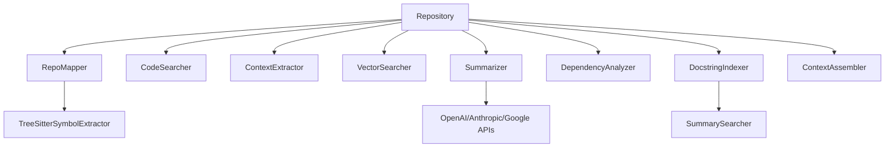

# CodeKite Code Intelligence Tools

[](https://github.com/shaneholloman/codekite/actions/workflows/ci.yml)

`codekite` is a Python toolset for codebase mapping, symbol extraction, code search, and context generation for LLMs. It provides a structured API for analyzing codebases and generating appropriate context for various development tasks.

## Architecture



## Installation

### Install from PyPI

```sh
# Basic installation
uv tool install codekite

# With OpenAI support
uv tool install codekite[openai]

# With all features
uv tool install codekite[all]
```

### Install from Source

```sh
git clone https://github.com/shaneholloman/codekite.git
cd codekite
uv sync
uv pip install -e .
```

## Basic Usage

```python
from codekite import Repository

# Load a local repository
repo = Repository("/path/to/your/local/codebase")

# Or load a remote GitHub repo
# repo = Repository("https://github.com/owner/repo")

# Get file structure
file_tree = repo.get_file_tree()
# Output: [{"path": "src/main.py", "is_dir": False, ...}, ...]

# Extract symbols from a file
symbols = repo.extract_symbols('src/main.py')
# Output: [{"name": "main", "type": "function", "file": "src/main.py", ...}, ...]
```

## Core Components

CodeKite consists of several modular components:

1. **Repository** - Main interface for accessing codebases
2. **RepoMapper** - Maps repository structure and extracts symbols
3. **TreeSitterSymbolExtractor** - Language-aware symbol extraction using tree-sitter
4. **CodeSearcher** - Text and regex search across files
5. **ContextExtractor** - Extracts context around specific lines or symbols
6. **VectorSearcher** - Semantic search capabilities using vector embeddings
7. **DocstringIndexer** - Builds a searchable index of code summaries
8. **Summarizer** - Generates natural language summaries using LLMs
9. **DependencyAnalyzer** - Analyzes module dependencies and relationships
10. **ContextAssembler** - Formats code context for LLM prompts

## Features

### Code Structure Analysis

```python
# Get file tree
files = repo.get_file_tree()

# Extract symbols from all Python files
python_files = [f["path"] for f in files if f["path"].endswith(".py")]
for file in python_files:
    symbols = repo.extract_symbols(file)
```

### Code Search

```python
# Text search
results = repo.search_text("function_name", file_pattern="*.py")

# Semantic search (requires embedding function)
from sentence_transformers import SentenceTransformer
model = SentenceTransformer("all-MiniLM-L6-v2")
embed_fn = lambda text: model.encode(text).tolist()

vector_searcher = repo.get_vector_searcher(embed_fn=embed_fn)
results = repo.search_semantic("function that handles user authentication", top_k=5)
```

### Context Extraction

```python
# Chunk file by lines
chunks = repo.chunk_file_by_lines("src/main.py", max_lines=50)

# Chunk file by symbols (functions, classes)
symbol_chunks = repo.chunk_file_by_symbols("src/main.py")

# Extract context around line
context = repo.extract_context_around_line("src/main.py", line=42)
```

### LLM-Powered Summarization

```python
# Configure OpenAI for summarization
from codekite.summaries import OpenAIConfig
openai_config = OpenAIConfig(api_key="YOUR_API_KEY", model="gpt-4o")

# Initialize summarizer
summarizer = repo.get_summarizer(config=openai_config)

# Summarize file
file_summary = summarizer.summarize_file("src/main.py")

# Summarize specific function
function_summary = summarizer.summarize_function("src/main.py", "process_data")
```

### Dependency Analysis

```python
# Get dependency analyzer
analyzer = repo.get_dependency_analyzer()

# Build dependency graph
graph = analyzer.build_dependency_graph()

# Find cycles
cycles = analyzer.find_cycles()

# Visualize dependencies
analyzer.visualize_dependencies("dependencies.png", format="png")
```

### CLI Usage

CodeKite includes a command-line interface:

```sh
# Show version
codekite version

# Perform text search
codekite search /path/to/repo "search_query" --pattern "*.py"

# Start API server
codekite serve --port 8000
```

## Supported Languages

- Python
- JavaScript
- TypeScript
- Go
- Rust
- HCL/Terraform
- C
- Ruby
- Java

## License

MIT License
